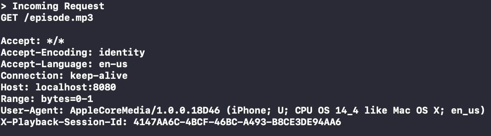

# Testing iOS AVFoundation AVPlayer API

Tests how to use [AVFoundation AVPlayer](https://developer.apple.com/documentation/avfoundation/avplayer) API in order to have a custom User-Agent on each network request.

In this demo, can test different setups of AVPlayer. The goal is to making sure the `User-Agent` used in each network request is always the same, always the one that clearly identify your application.

There is a built-in webserver that logs on the Xcode console all requests that comes in.


## Goal

You should always see:
```
User-Agent: MyPodcastApp/1.0.1 (iPhone; iOS 14.4; en)
```

and never see:
```
User-Agent: AppleCoreMedia/1.0.0.18D46 (iPhone; U; CPU OS 14_4 like Mac OS X; en_us)
```

## Credits

Bundled audio file `bensound-goinghigher.mp3` comes from [Bensound.com](https://www.bensound.com/royalty-free-music/track/going-higher)

## License 

MIT
